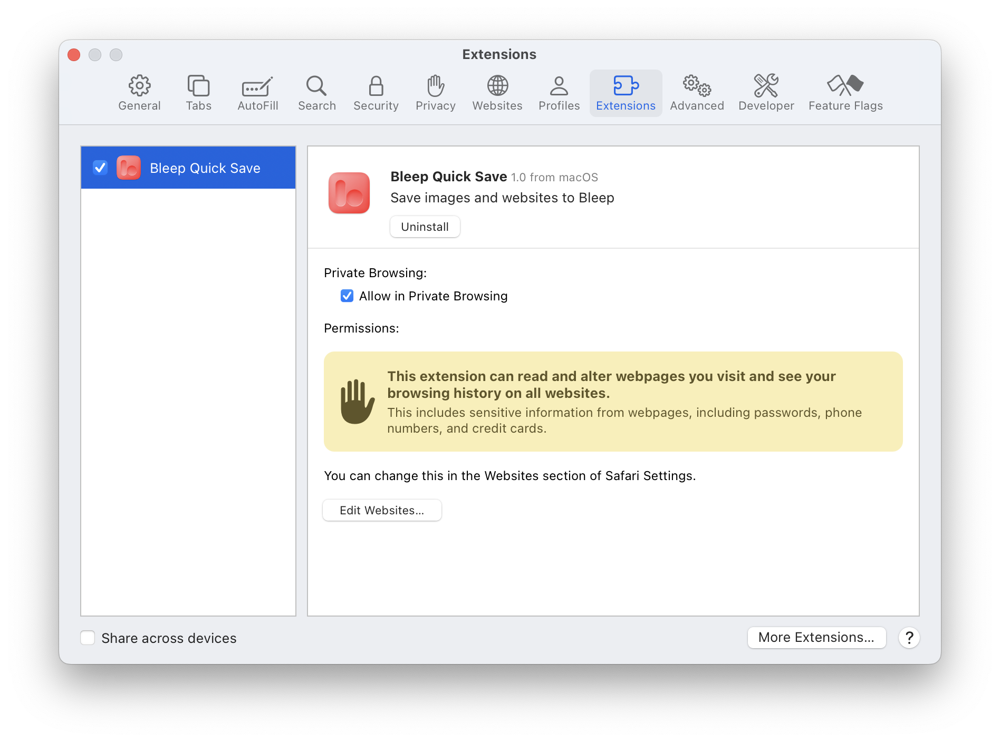
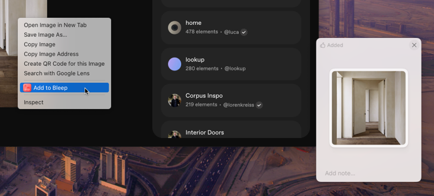

## Install on Chrome or Arc

1. [Install extension from Chrome Web Store.](https://chromewebstore.google.com/detail/cjfkfilhmpodcciidnmoiojffkmkgepj)  
   Compatible with Arc as well.
2. That's it! You're good to go.

### Important

- Bleep must be running on your computer for the extension to work.
- Since Bleep is a macOS/iOS app, this extension will not work on Windows or Linux.

---

## Install on Safari

The Safari extension comes bundled with the Bleep macOS app. It should prompt you to enable it whenever you open Safari right after installing.

### Manually enabling

1. Open Safari
2. Go to Safari > Settings > Extensions
3. Find "Bleep Quick Save" in the list and enable it

### Important

- Bleep must be running on your computer for the extension to work.
- For best experience, allow access to "All Websites" when prompted.

---

# Get Started

- Click the Bleep icon on your browser’s toolbar to save the current website to Bleep. You may need to pin it in Chrome.
- Right-click anywhere on the page and select "Add to Bleep" to save images (or the current website if not an image.)
