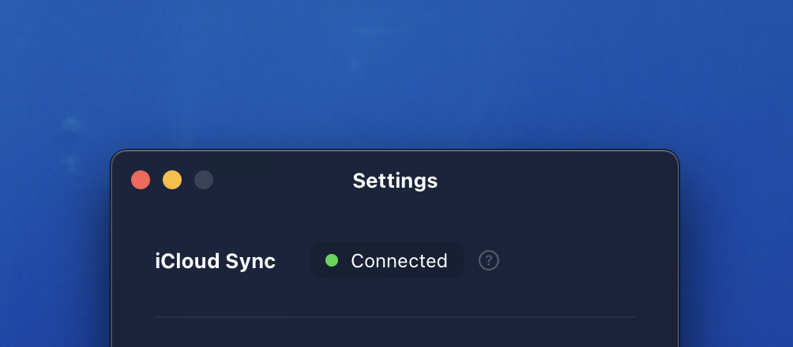

As long as you have Bleep on your iPhone and Mac, you can [sync your data securely](https://support.apple.com/en-us/102651) between them using iCloud. In most cases, this is already set up. But make sure to follow the steps below to ensure it's working.

## Set Up

1. Make sure the latest version of Bleep is installed
2. Make sure you're signed in to iCloud on your device
3. Follow Apple’s official steps to [enable iCloud Drive](https://support.apple.com/guide/icloud/set-up-icloud-drive-mm203b05aec8/icloud)

### Important

- You must be signed in with the same Apple ID on all devices
- Changes may take a few moments to sync (up to a minute)

### Confirm it's working

1. Open Bleep on your Mac
2. Go to Bleep > Settings
3. iCloud Sync should say Connected

