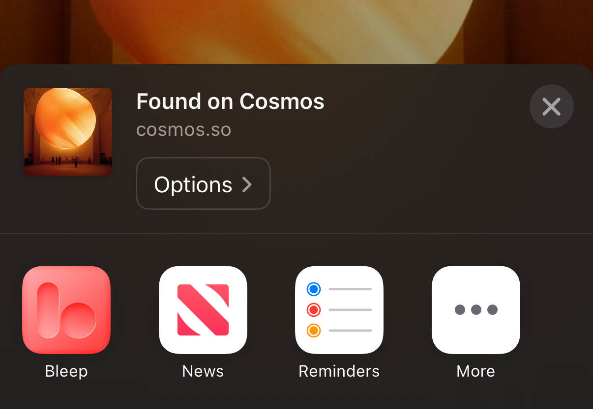

import Video from "../../components/Video.astro";

## Mac: Drag & Drop Directly

<Video src="/support/images/dnd_images.mov" autoplay />

Any images on your clipboard (`⌘ C`) can also be pasted (`⌘ V`) directly into Bleep.  

---

## iPhone: Share Menu Shortcut

The fastest way to save images on your iPhone. [Learn more &rarr;](/support/share_ios)

---

## Mac: Browser Extensions

Save images while browsing with our extensions for Safari, Chrome, and Arc. [Learn more &rarr;](/support/extensions)

