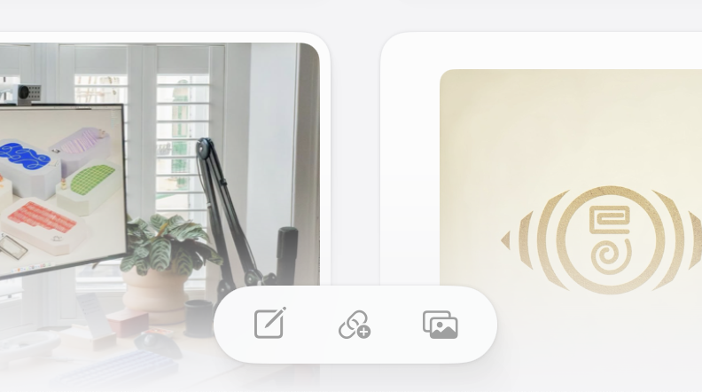
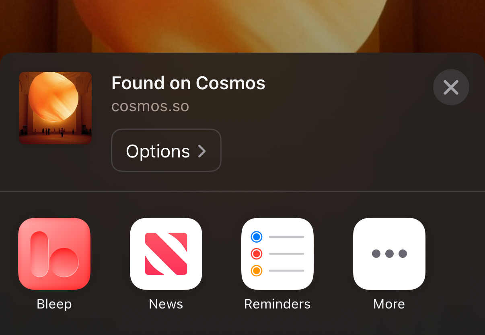
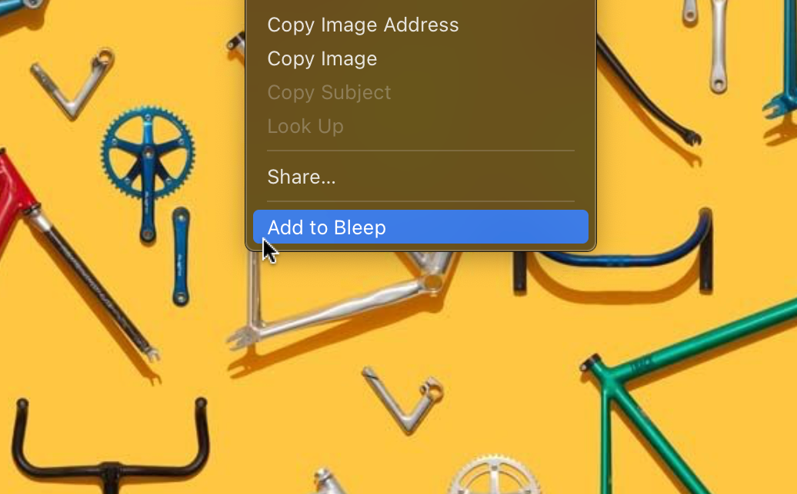

## Inside the app

You can save links via the Quick Add bar at the bottom of the screen.

## iPhone: Share Menu Shortcut

The easiest way to save links on iOS is to use the share sheet. Check out our [Share Extension guide](/support/share_ios) for more details.

## Mac: Browser Extensions

For Mac, we offer a browser extension for Safari, Chrome, and Arc. Check out the [Browser Extensions guide](/support/extensions) for more details.

