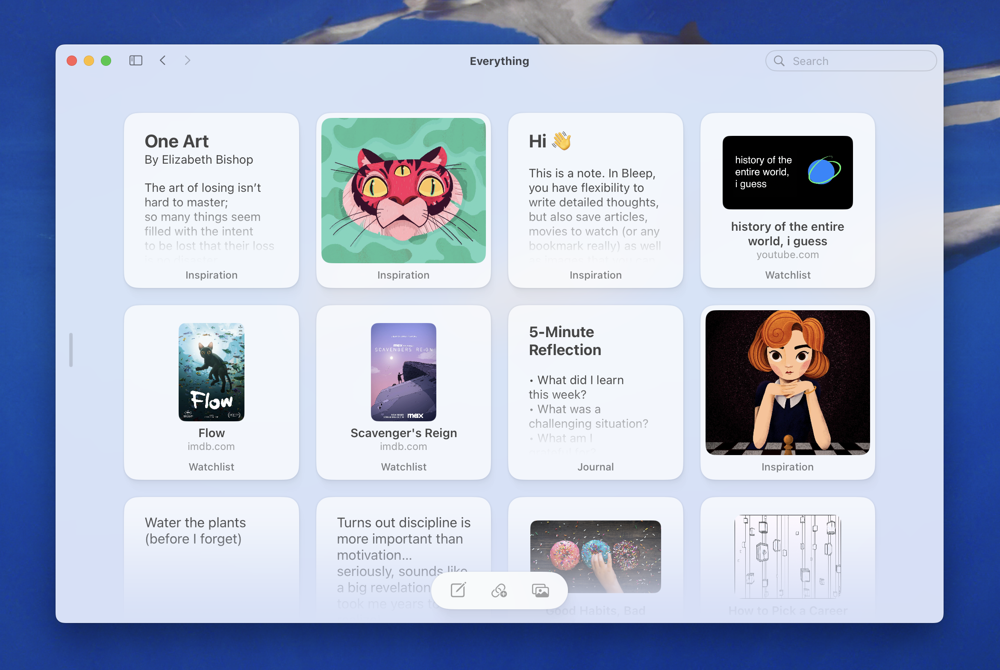
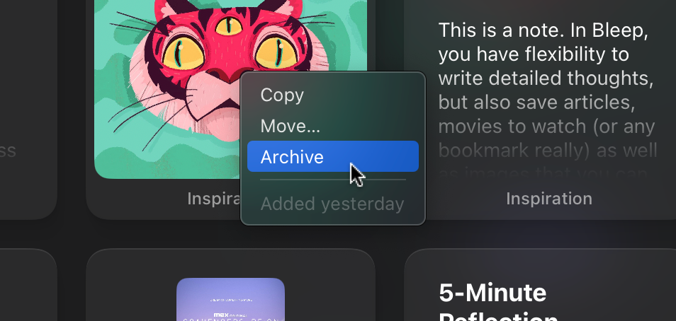

---

## Make a Room

Rooms are like folders, but with a focus in mind. Make a room for a project, a theme, or even a mood. Pick a memorable name, an emoji or custom icon, and start collecting.

And yes, you can make rooms inside of rooms.

---

[Video of the drag and drop functionality](/support/stay_organized/sorting_landscape.mp4)

## Break Loose

Not everything is chronological. Rearrange freely to curate, move away distracting items, or bring attention to the important ones.

The order of your items will be unique to the room they're in.

---

## Don't Be Afraid to Archive

In Bleep, you don't delete right away. You archive. This removes the decision paralysis that comes with deleting.

If something is on your way, just archive it. You can restore it later, or delete it permanently.
