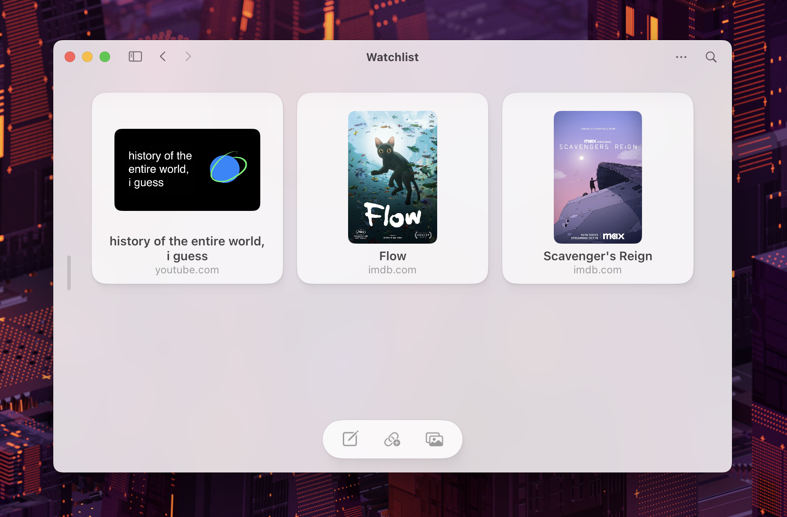

<Video src="/why/bleep.mp4" autoplay />
import Video from "../components/Video.astro";

Wanting to organize myself and my thoughts goes deeper than just "getting things done". It's how I make sense of my life and what makes me feel excited and grateful every day.

I looked around, in the so-called "productivity" tools, and found that they made me feel obsessed with being accomplished and efficient, instead of present and observant. They were also either too plain and dull, or too complicated to be practical.

So I took it upon myself to build Bleep to sort through my thoughts and ideas in a way that feels fun and relaxing.

## Ideas Come In Many Shapes

One of the things that I dislike the most about note-taking apps is the required title. I don't _always_ want to title my notes, but seeing an "Untitled" at the top of the page makes me feel unwelcome.

Also, who says I want to write a note to begin with? Maybe I just learned about a new movie and all I have time for is a link. What should I do? Make a new note just for that link, or do I switch to a completely different app to save that movie?

These sound like small problems, but I see a pattern of friction. Whenever you want to save anything, you shouldn't have to stop and ask yourself "how?" or "where?"

## Chaos Is Necessary

You also should be able to embrace messy, unfiltered thoughts and ideas all in one place, side by side, without needing to worry about where to put things. What most tools get wrong about organization is the idea that you have to create structure from the get-go. Structure comes and goes, but it should never get in the way of expressing your flow of thought.

## Form-Factor Matters

The way content is presented can often influence how we consume and process it. Can you move items around? Can you see many items at a glance? Is the space you're on primarily text-based (linear) or an infinite canvas? How you answer these questions will bring about a completely different experience.

For example, note apps tend to focus on one note or page at a time, with very little context of other notes you added. This creates a writing-centric experience, but as I mentioned earlier, not everything is a note or something that needs to be written in depth.

More advanced tools allow you to have different types of content, and even create more intricate layouts. But most of the time you have to build those and think about the structure upfront. And as such they have to be maintained, creating a mental block or extra effort whenever we want to add to them or modify them.

Achieving the right balance between the two ends of the spectrum is an ongoing process. But as a starting point, I decided to go with a more visual route using a square grid: no matter what you add, it will get its dedicated square preview with the same visual prominence so you can see many items at once while being able to rearrange, group, move, or zoom into one of them.

## Structure Should Follow Aspiration

When we want to group related elements in productivity systems we tend to use terminology like "folders" or "projects".

A "folder" is derived from file systems on computers which themselves are analogies to real life organization used mainly in the office.

A "project" implies work and a goal in mind — too action oriented. There's nothing wrong with wanting to get something done, but why does that need to be the default assumption?

I wanted to organize myself as if my mind was a palace. Large, unconstrained. Filled with rooms, each with a purpose designated by me.

The term "room" is something we can all relate to. It's based in real life and you can tell how much you care about something by the time you spend inside a room.

## It's Not About "Productivity" Anyway

I mentioned how the current spectrum of "tools for thought" focus on making you feel accomplished and knowledgeable because those are the typical associations we make with "productivity". We typically use them exclusively for work but rarely to capture random thoughts, moments, or to keep track of places we want to revisit, physically or virtually.

I believe creative thinkers are less interested in building a robust and complex "second brain" when they already have big ideas and priorities in life. We simply don't want to lose track of what matters to us. We want to make room for it. This should make us feel present, whether that's on a weekday at work and writing our next big idea, or on the weekend checking out new music. Being present helps us better observe and understand ourselves.

## Wrapping Up

While I talk about Bleep and I'd love for you to try it, what I hope the most is to inspire you to demand more from the software that you use. Apps, if designed correctly, should make you feel happy, and as comfortable as you feel when you're at home. And ideally, they should help you understand yourself better and appreciate what you have more.
